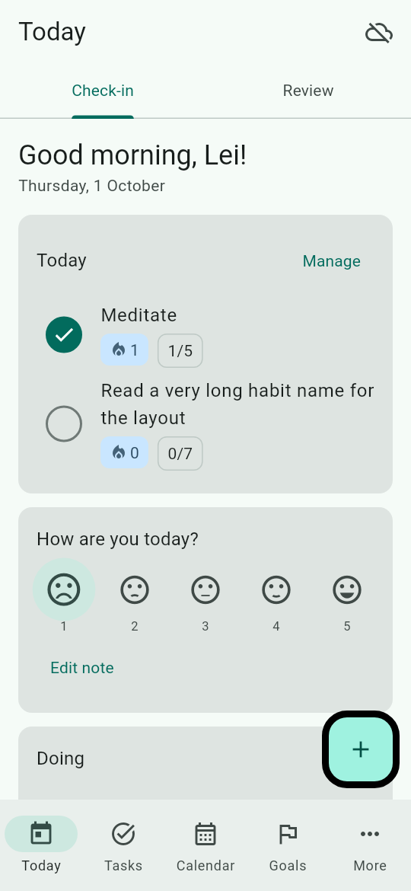
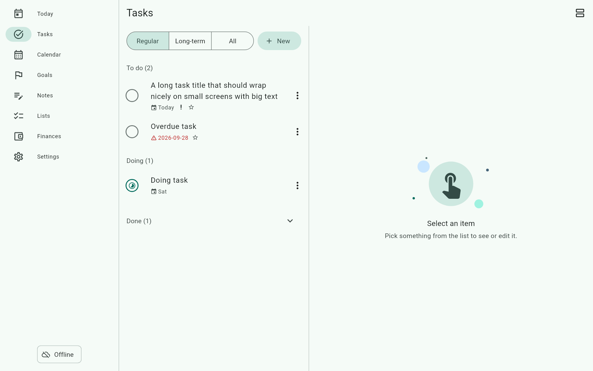

# LeiOS

Personal app for tasks, calendar, goals, habits + mood, notes, lists and finances. One user per account.
Flutter (Android first, plus Linux/Windows/macOS) · PowerSync (offline-first SQLite) · Supabase (Postgres, Auth, RLS).

| Compact (phone) | Expanded (desktop) |
|---|---|
|  |  |

- Works fully offline after the first sign-in; syncs through PowerSync Cloud when online.
- Eight destinations: Today (check-in + review), Tasks, Calendar, Goals, Notes, Lists, Finances, Settings.
- Material 3, mobile-first, master-detail on wide windows.

## Quick start
1. Stand up the cloud backend: **[docs/SETUP.md](docs/SETUP.md)**.
2. Run:
   ```bash
   flutter pub get
   flutter run -d linux \
     --dart-define=SUPABASE_URL=… --dart-define=SUPABASE_ANON_KEY=… --dart-define=POWERSYNC_URL=…
   ```
   (Android: `-d <device>`; Windows/macOS likewise.) Values are never committed; see `.env.example`.

## Develop
```bash
flutter analyze          # zero warnings
flutter test             # unit, repository, widget and layout-matrix tests (real local PowerSync DB)
xvfb-run -a flutter test integration_test/app_test.dart -d linux   # mock login → quick add → Today/Tasks
flutter test test/golden --run-skipped                              # regenerate docs/screenshots
```

## Docs
[SETUP](docs/SETUP.md) · [ARCHITECTURE](docs/ARCHITECTURE.md) · [SYNC](docs/SYNC.md) · [UI](docs/UI.md) · [DECISIONS](docs/DECISIONS.md) (includes what was *not* verified)
